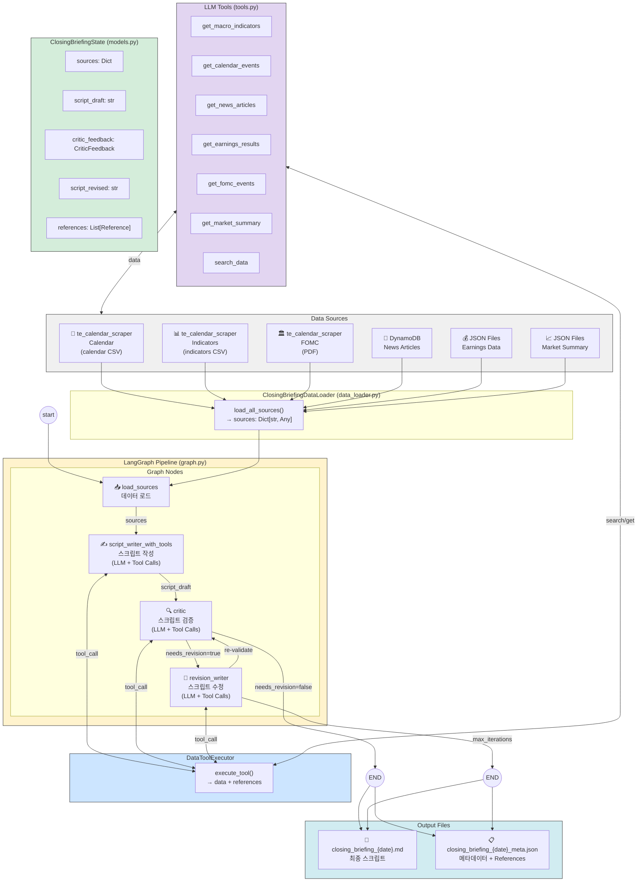

# Closing Briefing - Architecture Diagram Prompt

아래 프롬프트를 사용하여 다이어그램 생성 도구(Mermaid, Draw.io, Figma, Claude Artifacts 등)에서 아키텍처 다이어그램을 생성하세요.

---

## 다이어그램 생성 프롬프트 (한국어)

```
다음 구조의 시스템 아키텍처 다이어그램을 만들어주세요:

## 상단 영역: Data Sources (데이터 소스)

6개의 데이터 소스 박스를 상단에 배치:
1. [보라색] te_calendar_scraper - 경제 일정 (calendar CSV)
2. [초록색] te_calendar_scraper - 거시경제 지표 (indicators CSV)
3. [주황색] te_calendar_scraper - FOMC 기자회견 (fomc_press_conferences PDF)
4. [파랑색] DynamoDB - 뉴스 기사 (news_data)
5. [노랑색] JSON Files - 실적 데이터 (earnings_data)
6. [청록색] JSON Files - 시장 요약 (market_summary)

## 중앙 영역: LangGraph Pipeline

중앙에 LangGraph 워크플로우 박스 배치:
- graph.py
- StateGraph(ClosingBriefingState)
- 노드: load_sources → script_writer → critic → revision_writer

## LLM 도구 영역: Tool Calls

스크립트 작성 및 검증에 사용되는 7개 도구:
1. get_macro_indicators - 거시경제 지표 조회
2. get_calendar_events - 경제 캘린더 이벤트 조회
3. get_news_articles - 뉴스 기사 조회
4. get_earnings_results - 기업 실적 조회
5. get_fomc_events - FOMC 이벤트 조회
6. get_market_summary - 시장 요약 조회
7. search_data - 전체 데이터 검색

## 하단 영역: Graph Nodes

4개의 노드를 순서대로 배치:

### 1. load_sources 노드
- 연결: 모든 데이터 소스 → load_sources
- 기능: ClosingBriefingDataLoader로 데이터 로드
- 출력: ClosingBriefingState.sources

### 2. script_writer_with_tools 노드
- 연결: load_sources → script_writer
- 기능: LLM이 도구를 호출하여 스크립트 작성
- 입력: 도구 호출 결과 + 프롬프트
- 출력: script_draft + references

### 3. critic 노드
- 연결: script_writer → critic
- 기능: LLM이 도구를 호출하여 스크립트 검증
- 검증 항목: 환각, 시의성, 정보 가치, 출처 명시
- 출력: CriticFeedback

### 4. revision_writer 노드
- 연결: critic → revision_writer (조건부)
- 조건: needs_revision = True
- 기능: 피드백 기반 스크립트 수정
- 출력: script_revised

## 조건부 분기

1. critic → revision_writer (needs_revision = True)
2. critic → END (needs_revision = False)
3. revision_writer → critic (재검증 필요 시)
4. revision_writer → END (max_iterations 도달)

## 최하단: Output

출력 파일:
- closing_briefing_{date}_{timestamp}.md (최종 스크립트)
- closing_briefing_{date}_{timestamp}_meta.json (메타데이터)
- References 섹션 포함

## 흐름 화살표

1. [start] → load_sources
2. load_sources → script_writer_with_tools
3. script_writer ←→ DataToolExecutor (도구 호출)
4. script_writer → critic
5. critic ←→ DataToolExecutor (검증용 도구 호출)
6. critic → revision_writer 또는 END
7. revision_writer → critic 또는 END
8. [END] → Output Files

## 색상 스키마

- 데이터 소스: 각각 다른 파스텔 색상
- LLM 도구: 연한 보라색 배경
- Graph 노드: 연한 회색 또는 흰색 배경
- 조건부 분기: 점선 화살표
- Output: 연한 녹색 배경

## 스타일

- 둥근 모서리 박스
- 화살표에 데이터 흐름 설명 추가
- 각 노드 내부에 주요 함수/파일명 표시
- 한국어 설명 포함
```

---

## Mermaid.js 코드



---

## Draw.io / Figma용 텍스트 설명

### 레이아웃 구조

```
┌─────────────────────────────────────────────────────────────────────────────────┐
│                              Data Sources                                        │
├───────────┬───────────┬───────────┬───────────┬───────────┬────────────────────┤
│ Calendar  │ Indicators│   FOMC    │   News    │ Earnings  │  Market Summary    │
│  (CSV)    │   (CSV)   │   (PDF)   │ (DynamoDB)│  (JSON)   │     (JSON)         │
└─────┬─────┴─────┬─────┴─────┬─────┴─────┬─────┴─────┬─────┴──────────┬─────────┘
      │           │           │           │           │                │
      └───────────┴───────────┴───────────┴───────────┴────────────────┘
                                      │
                                      ▼
┌─────────────────────────────────────────────────────────────────────────────────┐
│                     ClosingBriefingDataLoader (data_loader.py)                   │
│                           load_all_sources() → sources                           │
└───────────────────────────────────────────────────────────────────────────────────┘
                                      │
                                      ▼
┌─────────────────────────────────────────────────────────────────────────────────┐
│                        LangGraph Pipeline (graph.py)                             │
│                     StateGraph(ClosingBriefingState)                             │
├─────────────────────────────────────────────────────────────────────────────────┤
│                                                                                 │
│  ┌─────────────┐     ┌─────────────────────┐     ┌─────────────┐               │
│  │ load_sources│ ──▶ │ script_writer_with_ │ ──▶ │   critic    │               │
│  │             │     │ tools               │     │             │               │
│  └─────────────┘     └──────────┬──────────┘     └──────┬──────┘               │
│                                 │                       │                       │
│                                 │ Tool Calls            │ Tool Calls            │
│                                 ▼                       ▼                       │
│                      ┌─────────────────────────────────────────────┐            │
│                      │           DataToolExecutor                   │            │
│                      │  get_macro_indicators, get_calendar_events   │            │
│                      │  get_news_articles, get_earnings_results     │            │
│                      │  get_fomc_events, get_market_summary         │            │
│                      │  search_data                                 │            │
│                      └─────────────────────────────────────────────┘            │
│                                                                                 │
│                                         │ needs_revision?                       │
│                                         ▼                                       │
│                      ┌──────────────────────────────────────────┐               │
│                      │          ┌─────────────────┐             │               │
│                      │   Yes ──▶│ revision_writer │──┐          │               │
│                      │          └─────────────────┘  │          │               │
│                      │                               │          │               │
│                      │          ┌─────────┐          │          │               │
│                      │    No ──▶│   END   │◀─────────┘          │               │
│                      │          └─────────┘  (max_iterations)   │               │
│                      └──────────────────────────────────────────┘               │
│                                                                                 │
└─────────────────────────────────────────────────────────────────────────────────┘
                                      │
                                      ▼
┌─────────────────────────────────────────────────────────────────────────────────┐
│                              Output Files                                        │
├──────────────────────────────────────┬──────────────────────────────────────────┤
│ 📄 closing_briefing_{date}.md        │ 📋 closing_briefing_{date}_meta.json     │
│    - 키워드                           │    - references: [...]                   │
│    - 스크립트 본문 (Host + Analyst)    │    - critic_feedback: {...}              │
│    - [REF: ...] 출처 태그             │    - iterations: N                       │
│    - References 섹션                  │                                          │
└──────────────────────────────────────┴──────────────────────────────────────────┘
```

---

## 핵심 컴포넌트 상세 설명

### ClosingBriefingState (models.py)

```
📊 ClosingBriefingState

진행자
"파이프라인의 상태를 관리합니다."

해설자
"LangGraph 워크플로우를 통해 전달되는 
모든 데이터와 중간 결과물을 저장합니다."

- sources: Dict[str, Any] (원본 데이터)
- script_draft: str (초안)
- critic_feedback: CriticFeedback (피드백)
- script_revised: str (수정본)
- references: List[Reference] (출처 목록)
- iterations: int (반복 횟수)
```

### DataToolExecutor (tools.py)

```
🔧 DataToolExecutor

진행자
"LLM이 데이터를 조회할 수 있게 합니다."

해설자
"LLM이 function calling으로 도구를 호출하면
실제 데이터를 조회하고 출처 참조를 생성합니다."

입력: tool_name, arguments
출력: {
  "data": [...],
  "references": [
    {
      "source_type": "macro_data",
      "source_file": "indicators_US.csv",
      "quote": "CPI YoY: 3.0%",
      "date": "2025-12-22"
    }
  ]
}
```

### script_writer_with_tools 노드

```
✍️ script_writer_with_tools

진행자
"스크립트를 작성합니다."

해설자
"LLM이 도구를 호출하여 정확한 데이터를 조회하고,
[REF: ...] 태그와 함께 한국어 대화형 스크립트를 생성합니다."

- 입력: sources, briefing_date
- 도구: BRIEFING_TOOLS (7개)
- 출력: script_draft, references
- 프롬프트: SCRIPT_WRITER_WITH_TOOLS_SYSTEM_PROMPT
```

### critic 노드

```
🔍 critic

진행자
"스크립트를 검증합니다."

해설자
"LLM이 도구를 호출하여 원본 데이터와 대조하고,
환각, 시의성, 정보 가치, 출처 명시를 검증합니다."

검증 항목:
1. 환각(Hallucination) 검증
2. 시의성(Timeliness) 검증
3. 정보 가치(Value) 검증
4. 출처 명시(Source Citation) 검증

출력: CriticFeedback {
  hallucinations_found: [],
  overall_quality: "우수|양호|보통|미흡|심각",
  specific_suggestions: []
}
```

### revision_writer 노드

```
📝 revision_writer

진행자
"스크립트를 수정합니다."

해설자
"Critic의 피드백을 바탕으로 환각을 제거하고
출처 누락을 보완하여 스크립트를 수정합니다."

- 입력: script_draft, critic_feedback
- 도구: BRIEFING_TOOLS (재검증용)
- 출력: script_revised
- 조건: needs_revision = True
```

---

## 색상 코드 (Hex)

| 구성요소 | 색상 | Hex |
|----------|------|-----|
| Data Sources | 연한 회색 | `#f0f0f0` |
| Calendar | 보라색 | `#e2d5f1` |
| Indicators | 초록색 | `#d4edda` |
| FOMC | 분홍색 | `#f8d7da` |
| News (DynamoDB) | 파랑색 | `#cce5ff` |
| Earnings/Market | 노랑색 | `#fff3cd` |
| LangGraph Pipeline | 연한 노랑 | `#fff3cd` |
| Tools | 연한 보라 | `#e2d5f1` |
| State | 연한 초록 | `#d4edda` |
| Output | 청록색 | `#d1ecf1` |

---

## 데이터 흐름 요약

```
1. 데이터 로드
   te_calendar_scraper/output + DynamoDB + JSON
   → ClosingBriefingDataLoader
   → ClosingBriefingState.sources

2. 스크립트 작성
   sources → script_writer_with_tools
   → LLM + Tool Calls (DataToolExecutor)
   → script_draft + references

3. 스크립트 검증
   script_draft → critic
   → LLM + Tool Calls (원본 데이터 대조)
   → CriticFeedback

4. 조건부 수정
   if needs_revision:
     → revision_writer
     → script_revised
   else:
     → END

5. 출력 저장
   → closing_briefing_{date}.md
   → closing_briefing_{date}_meta.json
```

