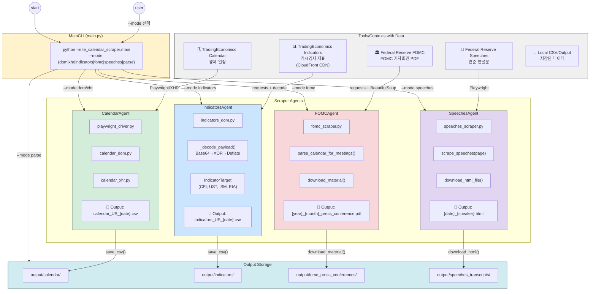

# TradingEconomics Calendar Scraper - Architecture Diagram Prompt

아래 프롬프트를 사용하여 다이어그램 생성 도구(Mermaid, Draw.io, Figma, Claude Artifacts 등)에서 아키텍처 다이어그램을 생성하세요.

---

## 다이어그램 생성 프롬프트 (한국어)

```
다음 구조의 시스템 아키텍처 다이어그램을 만들어주세요:

## 상단 영역: Tools/Contexts with Data (데이터 소스)

5개의 데이터 소스 박스를 상단에 배치:
1. [보라색] TradingEconomics Calendar - 경제 일정 (calendar_dom.py, calendar_xhr.py)
2. [초록색] TradingEconomics Indicators - 거시경제 지표 (indicators_dom.py)
3. [주황색] Federal Reserve FOMC - FOMC 기자회견 PDF (fomc_scraper.py)
4. [파랑색] Federal Reserve Speeches - 연준 연설문 (speeches_scraper.py)
5. [노랑색] Local CSV/Output - 저장된 데이터 (save_csv.py)

## 중앙 영역: Main Orchestrator

중앙에 MainCLI 박스 배치:
- main.py
- CLI 명령어: --mode {dom, xhr, indicators, fomc, speeches, parse}
- asyncio.run(main_async(mode))

## 하단 영역: Mode별 Agent/Module 그룹

왼쪽에서 오른쪽으로 4개 그룹:

### 1. CalendarAgent (DOM/XHR 모드)
- 연결: TradingEconomics Calendar → CalendarAgent
- 구성요소:
  - playwright_driver.py (브라우저 제어)
  - calendar_dom.py (DOM 스크래핑)
  - calendar_xhr.py (XHR 스크래핑)
- 출력: calendar_US_{date}.csv
- 설명: "미국 경제 일정 수집 → 필터링 (국가, 중요도, 날짜) → CSV 저장"

### 2. IndicatorsAgent (Indicators 모드)
- 연결: TradingEconomics Indicators → IndicatorsAgent
- 구성요소:
  - indicators_dom.py (API 호출)
  - _decode_payload() (Base64 → XOR → Deflate)
  - IndicatorTarget 설정 (CPI, UST, ISM, EIA)
- 출력: indicators_US_{date}.csv
- 설명: "CloudFront CDN API 호출 → 페이로드 디코딩 → 지표 값 추출 → CSV 저장"

### 3. FOMCAgent (FOMC 모드)
- 연결: Federal Reserve FOMC → FOMCAgent
- 구성요소:
  - fomc_scraper.py
  - fetch_calendar_html()
  - parse_calendar_for_meetings()
  - download_material()
- 출력: {year}_{month}_{dates}_press_conference.pdf
- 설명: "FOMC 캘린더 파싱 → Press Conference 링크 추출 → PDF 다운로드"

### 4. SpeechesAgent (Speeches 모드)
- 연결: Federal Reserve Speeches → SpeechesAgent
- 구성요소:
  - speeches_scraper.py
  - scrape_speeches(page)
  - download_html_file()
- 출력: {date}_{speaker}_{title}.html
- 설명: "연설 목록 스크래핑 → Transcript URL 추출 → HTML 다운로드"

## 최하단: Output Storage

우측 하단에 출력 저장소 박스:
- output/calendar/ (CSV)
- output/indicators/ (CSV)
- output/fomc_press_conferences/ (PDF)
- output/speeches_transcripts/ (HTML)

## 흐름 화살표

1. [start] → MainCLI (--mode 선택)
2. MainCLI → 각 Agent (mode에 따라 분기)
3. 각 Agent → 해당 데이터 소스 (API/웹 호출)
4. 각 Agent → Output Storage (파일 저장)
5. [parse 모드] Output Storage → MainCLI (CSV 파싱 및 요약)

## 색상 스키마

- 데이터 소스: 각각 다른 파스텔 색상
- Agent 박스: 연한 회색 또는 흰색 배경
- 화살표: 데이터 소스 색상과 매칭
- Output: 연한 녹색 배경

## 스타일

- 둥근 모서리 박스
- 화살표에 데이터 흐름 설명 추가
- 각 Agent 내부에 주요 함수/파일명 표시
- 한국어 설명 포함
```

---

## Mermaid.js 코드



---

## Draw.io / Figma용 텍스트 설명

### 레이아웃 구조

```
┌─────────────────────────────────────────────────────────────────────────────────┐
│                        Tools/Contexts with Data                                  │
├─────────────┬─────────────┬─────────────┬─────────────┬─────────────────────────┤
│ TE Calendar │ TE Indicators│ Fed FOMC   │ Fed Speeches│ Local Output            │
│   (보라색)   │   (초록색)    │  (주황색)   │   (파랑색)   │    (노랑색)              │
└──────┬──────┴──────┬──────┴──────┬──────┴──────┬──────┴─────────────────────────┘
       │             │             │             │
       ▼             ▼             ▼             ▼
┌─────────────────────────────────────────────────────────────────────────────────┐
│                              MainCLI (main.py)                                   │
│              python -m te_calendar_scraper.main --mode <mode>                    │
│                     asyncio.run(main_async(mode))                                │
└───────┬─────────────────┬─────────────────┬─────────────────┬───────────────────┘
        │                 │                 │                 │
        ▼                 ▼                 ▼                 ▼
┌───────────────┐ ┌───────────────┐ ┌───────────────┐ ┌───────────────┐
│ CalendarAgent │ │IndicatorsAgent│ │  FOMCAgent    │ │SpeechesAgent  │
├───────────────┤ ├───────────────┤ ├───────────────┤ ├───────────────┤
│ playwright_   │ │ indicators_   │ │ fomc_scraper  │ │ speeches_     │
│ driver.py     │ │ dom.py        │ │ .py           │ │ scraper.py    │
├───────────────┤ ├───────────────┤ ├───────────────┤ ├───────────────┤
│ calendar_dom  │ │ _decode_      │ │ parse_calendar│ │ scrape_       │
│ .py           │ │ payload()     │ │ _for_meetings │ │ speeches()    │
├───────────────┤ ├───────────────┤ ├───────────────┤ ├───────────────┤
│ calendar_xhr  │ │ IndicatorTarget│ │ download_     │ │ download_     │
│ .py           │ │ (CPI,UST,ISM) │ │ material()    │ │ html_file()   │
├───────────────┤ ├───────────────┤ ├───────────────┤ ├───────────────┤
│ 📄 calendar_  │ │ 📄 indicators_│ │ 📄 {year}_    │ │ 📄 {date}_    │
│ US_{date}.csv │ │ US_{date}.csv │ │ press_conf.pdf│ │ {speaker}.html│
└───────┬───────┘ └───────┬───────┘ └───────┬───────┘ └───────┬───────┘
        │                 │                 │                 │
        ▼                 ▼                 ▼                 ▼
┌─────────────────────────────────────────────────────────────────────────────────┐
│                              Output Storage                                      │
├─────────────────┬─────────────────┬─────────────────┬───────────────────────────┤
│ output/calendar/│output/indicators│output/fomc_     │output/speeches_           │
│     (CSV)       │     (CSV)       │press_conferences│transcripts (HTML)         │
│                 │                 │     (PDF)       │                           │
└─────────────────┴─────────────────┴─────────────────┴───────────────────────────┘
```

---

## 각 Agent 상세 설명 (박스 내 표시용)

### CalendarAgent
```
📅 CalendarAgent (DOM/XHR 모드)

진행자
"경제 일정을 수집합니다."

해설자  
"TradingEconomics 캘린더에서 미국 경제 이벤트를 
스크래핑하여 CSV로 저장합니다."

- Playwright 브라우저 → calendar_dom.py
- 쿠키 기반 필터 → calendar_xhr.py
- 필터: 국가(US), 중요도(1,2,3), 날짜(±7일)
```

### IndicatorsAgent
```
📊 IndicatorsAgent (Indicators 모드)

진행자
"거시경제 지표를 수집합니다."

해설자
"CloudFront CDN에서 인코딩된 지표 데이터를 
디코딩하여 최신 값을 추출합니다."

- API: d3ii0wo49og5mi.cloudfront.net
- 디코딩: Base64 → XOR → Deflate
- 지표: CPI, PMI, UST Yields, EIA 재고
```

### FOMCAgent
```
🏛️ FOMCAgent (FOMC 모드)

진행자
"FOMC 기자회견 자료를 다운로드합니다."

해설자
"Federal Reserve 웹사이트에서 최근 10개의 
FOMC 기자회견 transcript PDF를 수집합니다."

- 파싱: fomccalendars.htm
- 추출: Press Conference 링크
- 다운로드: PDF (최근 10개)
```

### SpeechesAgent
```
🎤 SpeechesAgent (Speeches 모드)

진행자
"연준 연설문을 다운로드합니다."

해설자
"Federal Reserve 연설 페이지에서 
transcript HTML 파일을 수집합니다."

- 스크래핑: Playwright
- 추출: Transcript URL
- 다운로드: HTML 페이지
```

---

## 색상 코드 (Hex)

| 구성요소 | 색상 | Hex |
|----------|------|-----|
| TradingEconomics Calendar | 보라색 | `#e2d5f1` |
| TradingEconomics Indicators | 초록색 | `#d4edda` |
| Federal Reserve FOMC | 주황색/분홍색 | `#f8d7da` |
| Federal Reserve Speeches | 파랑색 | `#cce5ff` |
| Local Output | 노랑색 | `#fff3cd` |
| MainCLI | 연한 노랑 | `#fff3cd` |
| Output Storage | 청록색 | `#d1ecf1` |
| 화살표 (Calendar) | 보라색 | `#6f42c1` |
| 화살표 (Indicators) | 초록색 | `#28a745` |
| 화살표 (FOMC) | 주황색 | `#dc3545` |
| 화살표 (Speeches) | 파랑색 | `#007bff` |

---

## 예시 이미지 참고 사항

제공된 예시 이미지와 유사하게:
- 상단에 데이터 소스 박스들을 가로로 배열
- 중앙에 MainAgent(여기서는 MainCLI) 배치
- 하단에 각 모드별 Agent 그룹을 가로로 배열
- 최하단에 Output/Citation 영역
- 각 Agent 박스 내부에 구성요소와 설명 텍스트 포함
- 데이터 흐름을 색상별 화살표로 표시

