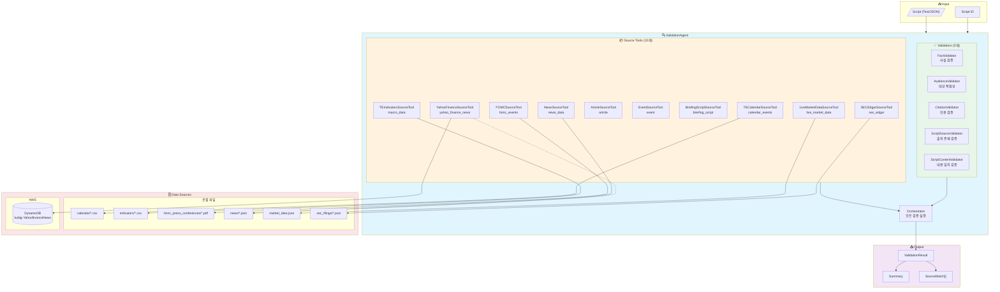
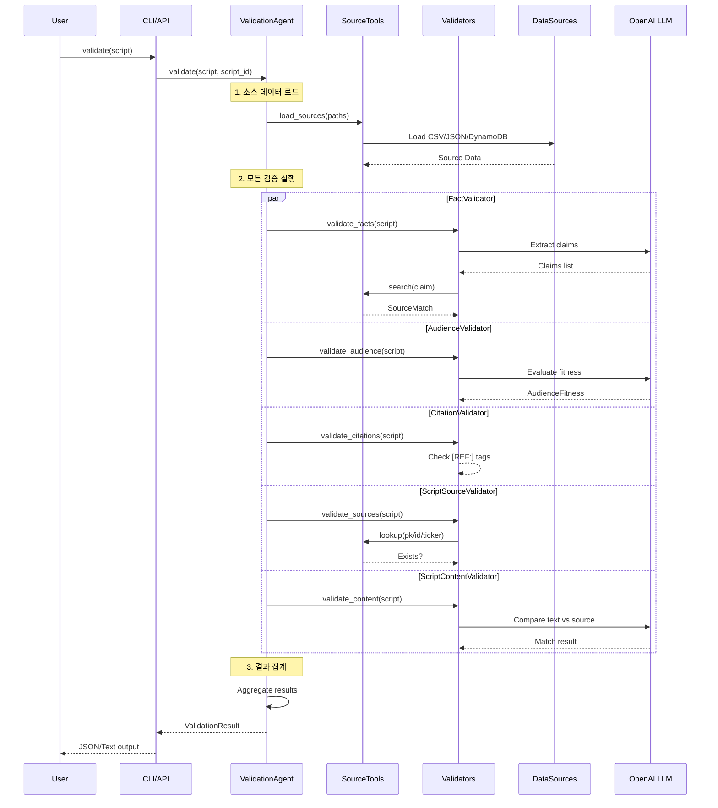
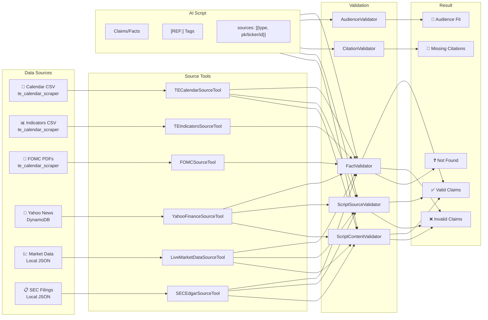

# Validation Agent - Architecture Diagram Prompts

이 문서는 Validation Agent의 아키텍처 다이어그램을 생성하기 위한 프롬프트를 제공합니다.

---

## 1. Mermaid.js 다이어그램

### 전체 시스템 아키텍처



### 검증 플로우 다이어그램



### 소스 도구 클래스 다이어그램

```mermaid
classDiagram
    class SourceTool {
        <<abstract>>
        +source_type: str
        +load_sources(path: Path)
        +search(query: str) List~Dict~
        +validate_claim(claim, ref) SourceMatch
        +get_tool_definition() Dict
    }

    class TECalendarSourceTool {
        -_data: List~Dict~
        -_loaded: bool
        +source_type = "calendar_events"
        +_load_csv(path)
    }

    class TEIndicatorsSourceTool {
        -_data: List~Dict~
        -_loaded: bool
        +source_type = "macro_data"
        +_load_csv(path)
    }

    class FOMCSourceTool {
        -_data: List~Dict~
        -_loaded: bool
        +source_type = "fomc_events"
    }

    class NewsSourceTool {
        -_data: List~Dict~
        -_loaded: bool
        +source_type = "news_data"
        +_load_json(path)
    }

    class YahooFinanceSourceTool {
        -_table_name: str
        -_region: str
        -_profile: str
        -_data: Dict~str, Dict~
        +source_type = "yahoo_finance_news"
        +_load_from_dynamodb()
        +load_by_pks(pks: List~str~)
    }

    class LiveMarketDataSourceTool {
        -_data_path: Path
        -_data: Dict~str, Dict~
        -_historical: Dict~str, List~
        +source_type = "live_market_data"
        +get_ticker_data(ticker)
        +get_historical(ticker, start, end)
    }

    class SECEdgarSourceTool {
        -_data_path: Path
        -_data: Dict~str, Dict~
        -_by_company: Dict~str, List~
        +source_type = "sec_edgar"
        +get_filing(accession)
        +get_company_filings(company, form)
    }

    class ArticleSourceTool {
        -_dynamodb_table: str
        -_data: Dict~str, Dict~
        +source_type = "article"
        +load_from_dynamodb(pks)
        +search_by_pk(pk)
    }

    class EventSourceTool {
        -_data: Dict~str, Dict~
        +source_type = "event"
        +search_by_id(id)
    }

    class BriefingScriptSourceTool {
        -_articles: Dict
        -_charts: Dict
        -_events: Dict
        +source_type = "briefing_script"
        +add_articles(articles)
        +add_events(events)
        +add_charts(charts)
    }

    SourceTool <|-- TECalendarSourceTool
    SourceTool <|-- TEIndicatorsSourceTool
    SourceTool <|-- FOMCSourceTool
    SourceTool <|-- NewsSourceTool
    SourceTool <|-- YahooFinanceSourceTool
    SourceTool <|-- LiveMarketDataSourceTool
    SourceTool <|-- SECEdgarSourceTool
    SourceTool <|-- ArticleSourceTool
    SourceTool <|-- EventSourceTool
    SourceTool <|-- BriefingScriptSourceTool
```



### 데이터 흐름 다이어그램



---

## 2. Draw.io / Figma용 ASCII 다이어그램

### 시스템 컴포넌트 레이아웃

```
┌─────────────────────────────────────────────────────────────────────────────────────┐
│                              VALIDATION AGENT SYSTEM                                 │
├─────────────────────────────────────────────────────────────────────────────────────┤
│                                                                                      │
│  ┌─────────────────┐                                                                │
│  │   INPUT         │                                                                │
│  │  ┌───────────┐  │                                                                │
│  │  │ Script    │  │                                                                │
│  │  │ (Text/JSON│  │                                                                │
│  │  └─────┬─────┘  │                                                                │
│  └────────│────────┘                                                                │
│           │                                                                          │
│           ▼                                                                          │
│  ┌────────────────────────────────────────────────────────────────────────────────┐ │
│  │                         VALIDATION AGENT                                        │ │
│  │  ┌──────────────────────────────────────────────────────────────────────────┐  │ │
│  │  │                        SOURCE TOOLS (10)                                  │  │ │
│  │  │  ┌────────────┐ ┌────────────┐ ┌────────────┐ ┌────────────────────────┐ │  │ │
│  │  │  │TE Calendar │ │TE Indicator│ │   FOMC     │ │    News/Article/Event  │ │  │ │
│  │  │  │   (CSV)    │ │   (CSV)    │ │   (PDF)    │ │        (JSON)          │ │  │ │
│  │  │  └────────────┘ └────────────┘ └────────────┘ └────────────────────────┘ │  │ │
│  │  │  ┌────────────────────┐ ┌─────────────────┐ ┌──────────────────────────┐ │  │ │
│  │  │  │ Yahoo Finance      │ │ Live Market     │ │ SEC Edgar                │ │  │ │
│  │  │  │ (DynamoDB/JSON)    │ │ (Local JSON)    │ │ (Local JSON)             │ │  │ │
│  │  │  └────────────────────┘ └─────────────────┘ └──────────────────────────┘ │  │ │
│  │  └──────────────────────────────────────────────────────────────────────────┘  │ │
│  │                                    │                                            │ │
│  │                                    ▼                                            │ │
│  │  ┌──────────────────────────────────────────────────────────────────────────┐  │ │
│  │  │                         VALIDATORS (5)                                    │  │ │
│  │  │  ┌─────────────┐ ┌─────────────┐ ┌─────────────┐                         │  │ │
│  │  │  │    Fact     │ │  Audience   │ │  Citation   │                         │  │ │
│  │  │  │  Validator  │ │  Validator  │ │  Validator  │                         │  │ │
│  │  │  └─────────────┘ └─────────────┘ └─────────────┘                         │  │ │
│  │  │  ┌─────────────────────────┐ ┌─────────────────────────┐                 │  │ │
│  │  │  │  Script Source          │ │  Script Content          │                 │  │ │
│  │  │  │  Validator              │ │  Validator (LLM)         │                 │  │ │
│  │  │  └─────────────────────────┘ └─────────────────────────┘                 │  │ │
│  │  └──────────────────────────────────────────────────────────────────────────┘  │ │
│  └────────────────────────────────────────────────────────────────────────────────┘ │
│           │                                                                          │
│           ▼                                                                          │
│  ┌─────────────────────────────────────────────────────────────────────────────────┐│
│  │                            VALIDATION RESULT                                     ││
│  │  ┌───────────────┐ ┌───────────────┐ ┌───────────────┐ ┌───────────────────────┐││
│  │  │ Source Matches│ │Audience Fitness│ │Missing Citations│ │  Overall Valid    │││
│  │  │ (valid/invalid│ │(excellent/good │ │  (list)        │ │  (true/false)      │││
│  │  │  /not_found)  │ │  /fair/poor)  │ │                │ │                     │││
│  │  └───────────────┘ └───────────────┘ └───────────────┘ └───────────────────────┘││
│  └─────────────────────────────────────────────────────────────────────────────────┘│
└─────────────────────────────────────────────────────────────────────────────────────┘
```

### 데이터 소스 연결도

```
┌─────────────────────────────────────────────────────────────────────────────────────┐
│                              DATA SOURCE CONNECTIONS                                 │
├─────────────────────────────────────────────────────────────────────────────────────┤
│                                                                                      │
│  ┌─────────────────────────────┐       ┌─────────────────────────────────────────┐  │
│  │      LOCAL FILES            │       │            AWS CLOUD                     │  │
│  │                             │       │                                          │  │
│  │  te_calendar_scraper/output/│       │  ┌─────────────────────────────────┐    │  │
│  │  ├── calendar/              │       │  │         DynamoDB                 │    │  │
│  │  │   └── calendar_US_*.csv  │───┐   │  │  kubig-YahoofinanceNews          │    │  │
│  │  ├── indicators/            │   │   │  │  ┌─────────────────────────┐    │    │  │
│  │  │   └── indicators_US_*.csv│───┤   │  │  │ pk (String, PK)         │    │    │  │
│  │  └── fomc_press_conferences/│   │   │  │  │ title                   │    │    │  │
│  │      └── *.pdf              │───┤   │  │  │ url                     │    │    │  │
│  │                             │   │   │  │  │ provider                │    │    │  │
│  │  user_data/                 │   │   │  │  │ publish_et_iso          │    │    │  │
│  │  ├── market_data.json       │───┤   │  │  │ tickers[]               │    │    │  │
│  │  └── sec_filings/           │   │   │  │  │ path                    │    │    │  │
│  │      └── *.json             │───┤   │  │  └─────────────────────────┘    │    │  │
│  │                             │   │   │  └──────────────┬──────────────────┘    │  │
│  └─────────────────────────────┘   │   │                 │                        │  │
│                                    │   └─────────────────│────────────────────────┘  │
│                                    │                     │                           │
│                                    ▼                     ▼                           │
│  ┌─────────────────────────────────────────────────────────────────────────────────┐│
│  │                           VALIDATION AGENT                                       ││
│  │                                                                                  ││
│  │  TECalendarSourceTool ◄──── calendar/*.csv                                      ││
│  │  TEIndicatorsSourceTool ◄── indicators/*.csv                                    ││
│  │  FOMCSourceTool ◄────────── fomc_press_conferences/*.pdf                        ││
│  │  YahooFinanceSourceTool ◄── DynamoDB (primary) / JSON (fallback)                ││
│  │  LiveMarketDataSourceTool ◄ market_data.json (user provided)                    ││
│  │  SECEdgarSourceTool ◄────── sec_filings/*.json (user provided)                  ││
│  │                                                                                  ││
│  └─────────────────────────────────────────────────────────────────────────────────┘│
└─────────────────────────────────────────────────────────────────────────────────────┘
```

---

## 3. 이미지 생성 AI 프롬프트

### DALL-E / Midjourney 프롬프트

#### 시스템 아키텍처 다이어그램

```
Create a clean, professional software architecture diagram for an "AI Script Validation Agent" system.

The diagram should show:
1. INPUT section (left): A document/script icon entering the system
2. VALIDATION AGENT (center, large box):
   - SOURCE TOOLS layer (top): 10 connected boxes representing different data sources:
     * TradingEconomics Calendar (CSV icon)
     * TradingEconomics Indicators (chart icon)
     * FOMC Press Conferences (PDF icon)
     * Yahoo Finance News (DynamoDB cloud icon)
     * Live Market Data (stock chart icon)
     * SEC Edgar Filings (document icon)
   - VALIDATORS layer (bottom): 5 connected boxes:
     * Fact Validator (checkmark icon)
     * Audience Validator (person icon)
     * Citation Validator (quote icon)
     * Source Validator (link icon)
     * Content Validator (document compare icon)
3. OUTPUT section (right): Validation result with checkmarks and X marks

Color scheme: Blue for input, Orange for source tools, Green for validators, Purple for output
Style: Modern, flat design, professional tech diagram
Include arrows showing data flow from left to right
Add small icons to represent each component type
```

#### 데이터 플로우 다이어그램

```
Create a data flow diagram showing how an AI validation system processes scripts.

Flow:
1. START: AI-generated script (Korean financial news script)
2. PARSE: Extract claims and references from the script
3. LOAD DATA: Connect to multiple data sources (show database, CSV, JSON icons)
4. VALIDATE: Run 5 parallel validation checks (show branching arrows)
   - Fact checking against source data
   - Audience fitness evaluation
   - Citation completeness check
   - Source existence verification
   - Content accuracy validation
5. AGGREGATE: Combine all validation results
6. OUTPUT: Final validation report with pass/fail status

Style: Clean flowchart with rounded rectangles
Colors: Light blue background, dark blue boxes, green for success paths, red for failure paths
Include Korean and English labels
```

#### 컴포넌트 관계도

```
Create a component relationship diagram for a modular validation framework.

Show a central "ValidationAgent" hub connected to:
- 10 "SourceTool" nodes arranged in a semicircle above (each with a small icon):
  * Calendar, Indicators, FOMC, News, Article, Event, Yahoo Finance, Market Data, SEC Edgar, Briefing Script
- 5 "Validator" nodes arranged in a semicircle below:
  * Fact, Audience, Citation, Script Source, Script Content

Draw lines connecting:
- All SourceTools to the central ValidationAgent
- All Validators to the central ValidationAgent
- Show LLM (OpenAI) icon connected to Fact, Audience, and Content validators

Style: Network topology diagram
Colors: Hub in blue, SourceTools in orange, Validators in green, LLM in purple
Modern, minimalist design with subtle gradients
```

---

## 4. Excalidraw / Whimsical 템플릿

```yaml
# Excalidraw JSON 구조
elements:
  - type: rectangle
    id: validation-agent
    label: "ValidationAgent"
    width: 600
    height: 400
    fill: "#e3f2fd"
    
  - type: rectangle
    id: source-tools
    label: "Source Tools (10)"
    width: 550
    height: 120
    fill: "#fff3e0"
    parent: validation-agent
    
  - type: rectangle
    id: validators
    label: "Validators (5)"
    width: 550
    height: 100
    fill: "#e8f5e9"
    parent: validation-agent

  # Source Tool boxes
  - type: rectangle
    id: te-calendar
    label: "TECalendar\nSourceTool"
    width: 80
    height: 50
    fill: "#ffcc80"
    
  - type: rectangle
    id: yahoo-finance
    label: "YahooFinance\nSourceTool"
    width: 80
    height: 50
    fill: "#ffcc80"
    icon: "database"
    
  - type: rectangle
    id: market-data
    label: "LiveMarketData\nSourceTool"
    width: 80
    height: 50
    fill: "#ffcc80"
    icon: "chart"
    
  - type: rectangle
    id: sec-edgar
    label: "SECEdgar\nSourceTool"
    width: 80
    height: 50
    fill: "#ffcc80"
    icon: "document"

  # Validator boxes
  - type: rectangle
    id: fact-validator
    label: "FactValidator"
    width: 100
    height: 40
    fill: "#a5d6a7"
    
  - type: rectangle
    id: audience-validator
    label: "AudienceValidator"
    width: 100
    height: 40
    fill: "#a5d6a7"

  # Arrows
  - type: arrow
    from: input
    to: validation-agent
    
  - type: arrow
    from: validation-agent
    to: output
```

---

## 5. PlantUML 다이어그램

```plantuml
@startuml Validation Agent Architecture

!define RECTANGLE class

skinparam backgroundColor #FEFEFE
skinparam packageStyle rectangle
skinparam roundCorner 10

package "Input" #E3F2FD {
    [Script (Text/JSON)] as Script
    [Script ID] as ScriptID
}

package "Validation Agent" #F5F5F5 {
    
    package "Source Tools" #FFF3E0 {
        [TECalendarSourceTool] as TE_CAL
        [TEIndicatorsSourceTool] as TE_IND
        [FOMCSourceTool] as FOMC
        [NewsSourceTool] as NEWS
        [ArticleSourceTool] as ARTICLE
        [EventSourceTool] as EVENT
        [BriefingScriptSourceTool] as BRIEFING
        [YahooFinanceSourceTool] as YAHOO
        [LiveMarketDataSourceTool] as MARKET
        [SECEdgarSourceTool] as SEC
    }
    
    package "Validators" #E8F5E9 {
        [FactValidator] as V_FACT
        [AudienceValidator] as V_AUD
        [CitationValidator] as V_CIT
        [ScriptSourceValidator] as V_SRC
        [ScriptContentValidator] as V_CONT
    }
    
    [Orchestrator] as ORCH
}

package "Data Sources" #FCE4EC {
    database "DynamoDB\nkubig-YahoofinanceNews" as DDB
    folder "calendar/*.csv" as CSV_CAL
    folder "indicators/*.csv" as CSV_IND
    folder "fomc/*.pdf" as PDF_FOMC
    folder "market_data.json" as JSON_MKT
    folder "sec_filings/*.json" as JSON_SEC
}

cloud "OpenAI API" as LLM #E1BEE7

package "Output" #F3E5F5 {
    [ValidationResult] as RESULT
    [Summary] as SUMMARY
    [SourceMatch[]] as MATCHES
}

Script --> ORCH
ScriptID --> ORCH

TE_CAL --> CSV_CAL
TE_IND --> CSV_IND
FOMC --> PDF_FOMC
YAHOO --> DDB
MARKET --> JSON_MKT
SEC --> JSON_SEC

V_FACT --> LLM
V_AUD --> LLM
V_CONT --> LLM

ORCH --> V_FACT
ORCH --> V_AUD
ORCH --> V_CIT
ORCH --> V_SRC
ORCH --> V_CONT

ORCH --> RESULT
RESULT --> SUMMARY
RESULT --> MATCHES

@enduml
```

---

## 사용 방법

1. **Mermaid.js**: GitHub README, Notion, Obsidian에 직접 붙여넣기
2. **Draw.io**: ASCII 레이아웃을 참고하여 수동 작성
3. **DALL-E/Midjourney**: 프롬프트를 이미지 생성 AI에 입력
4. **PlantUML**: https://www.plantuml.com/plantuml/uml 에서 렌더링
5. **Excalidraw**: JSON 구조를 참고하여 작성

---

## 핵심 컴포넌트 요약

| 컴포넌트 | 개수 | 설명 |
|---------|------|------|
| **Source Tools** | 10 | 다양한 데이터 소스에서 정보 로드 및 검색 |
| **Validators** | 5 | 사실, 대상, 인용, 출처, 내용 검증 |
| **Data Sources** | 6+ | CSV, PDF, JSON, DynamoDB |
| **LLM Integration** | 3 | Fact, Audience, Content Validator가 OpenAI 사용 |
